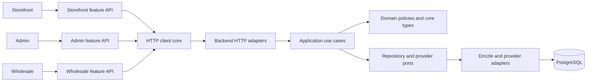

# Kvastram Architecture Baseline

## Purpose

This document defines the stable architecture boundary for incremental refactoring. It is intentionally compatible with the current Hono, Drizzle, and Next.js applications. It does not introduce a runtime framework or change public behavior.

## System context

## Dependency direction

Dependencies must point inward. Framework, network, database, and provider concerns are adapters around business behavior; they are not dependencies of that behavior.

| Layer | May depend on | Must not depend on |
|---|---|---|
| `backend/src/contracts` | TypeScript language types only | Hono, Drizzle, database, provider SDKs, route modules, service modules, application modules |
| `backend/src/domain` | `contracts`, other domain modules | Hono, Drizzle, PostgreSQL clients, route modules, middleware, configuration, provider SDKs |
| `backend/src/application` | `contracts`, `domain`, port interfaces | Hono, Drizzle, direct database clients, provider SDKs, Next.js |
| `backend/src/routes` | `application`, validation, transport helpers | Direct business workflow orchestration once a use case exists |
| `backend/src/db` and provider adapters | `contracts`, `domain`, ports | HTTP route concerns and React/Next.js concerns |
| Frontend feature modules | Feature API client, feature state, UI components | Backend source imports and another application’s private source tree |

## Boundary ownership

The core contracts in `backend/src/contracts` represent stable TypeScript boundaries for pagination, identifiers, errors, money, order state, and catalog read models. They are deliberately type-only and may be mapped to HTTP DTOs later. They are **not** a substitute for API versioning and they must not expose database implementation types.

Existing modules are allowed to retain their current structure until their refactoring workstream begins. New code should follow the target direction immediately; the architecture boundary checker enforces this for the new core folders.

## Refactoring rules

1. Preserve endpoint, response, cookie, and database behavior while moving implementation details.
2. Add a characterization test before extracting a critical checkout, order, payment, or catalog workflow.
3. Introduce a compatibility facade when an existing import path has more than one consumer.
4. Keep route handlers and page components thin: validation/composition belongs at the edge, business decisions belong in use cases or domain policies.
5. Do not introduce a shared package until two consumers share a tested, stable contract.

## Decisions

The following ADRs govern the refactoring program.

| ADR | Decision |
|---|---|
| [ADR-001](adr/ADR-001-dependency-direction.md) | Enforce inward dependency direction and framework-free core modules. |
| [ADR-002](adr/ADR-002-api-contract-and-compatibility.md) | Preserve public API behavior while introducing explicit contract types. |
| [ADR-003](adr/ADR-003-schema-modularization-without-data-migration.md) | Split schema source ownership without changing database structure. |
| [ADR-004](adr/ADR-004-evidence-based-shared-code-extraction.md) | Extract shared code only after tested cross-application equivalence. |
