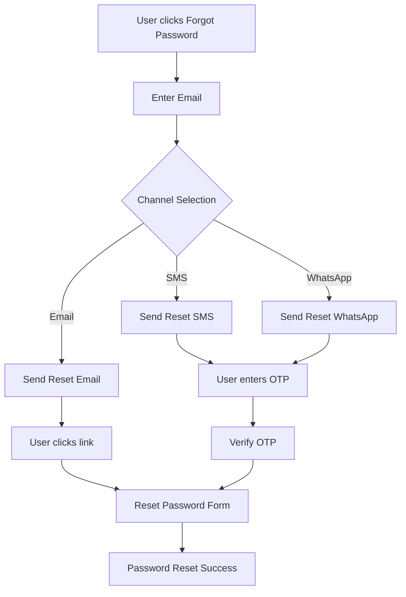
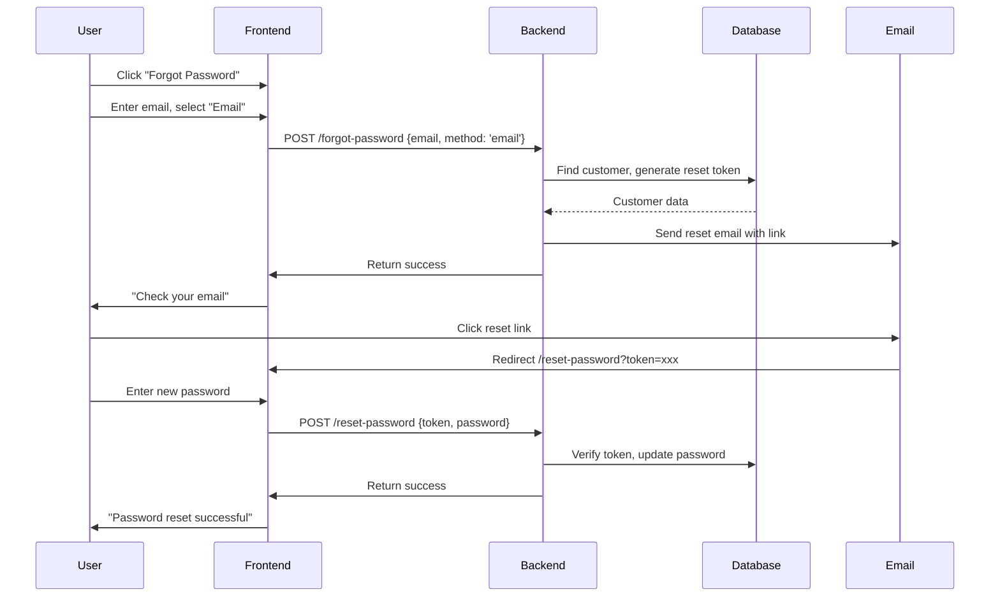
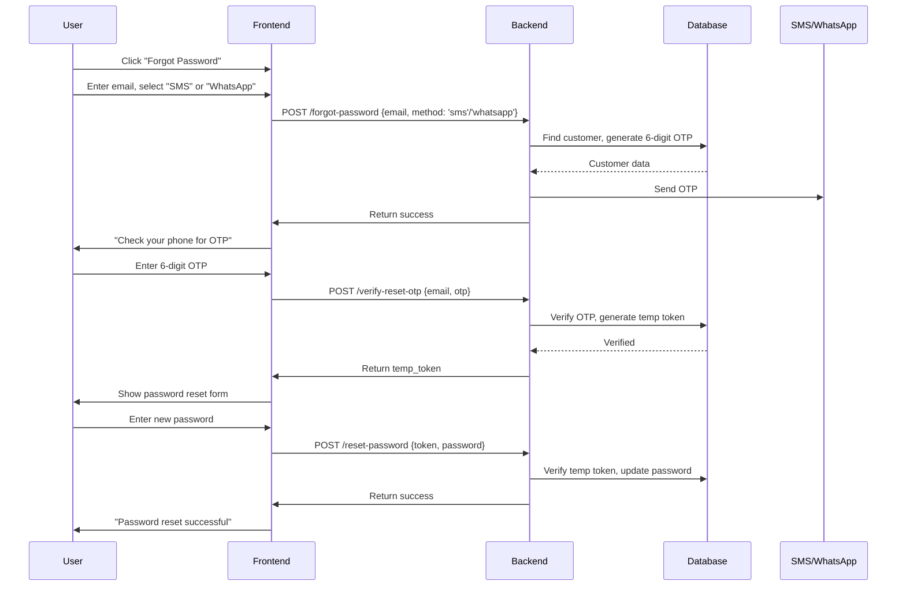

# Forgot Password Feature Implementation Plan (Enhanced)

## Executive Summary

This document provides a complete implementation plan for adding a forgot password feature with multiple verification methods to the existing storefront user login system. The implementation supports **email**, **SMS**, and **WhatsApp** verification options, with enhanced security measures.

---

## 1. Current System Analysis

### 1.1 Existing Infrastructure

| Component        | Status     | Notes                       |
| ---------------- | ---------- | --------------------------- |
| Email Service    | ✅ Ready   | Nodemailer with SMTP        |
| WhatsApp Service | ✅ Ready   | Facebook Business API       |
| SMS Strategy     | ⚠️ Partial | Mock implementation exists  |
| Rate Limiting    | ✅ Ready   | 3 requests/15 min for email |
| Account Lockout  | ✅ Ready   | 5 attempts, 15-min lockout  |

### 1.2 Existing Components

| Component             | Location                                          | Purpose                       |
| --------------------- | ------------------------------------------------- | ----------------------------- |
| Login Page            | `storefront/src/app/login/page.tsx`               | Email/password + social login |
| Auth Context          | `storefront/src/context/auth-context.tsx`         | Client-side auth state        |
| Auth Routes           | `backend/src/routes/store/auth.ts`                | REST API endpoints            |
| Auth Service          | `backend/src/services/customer-auth-service.ts`   | Business logic                |
| Email Service         | `backend/src/services/email-service.ts`           | Email sending                 |
| WhatsApp Routes       | `backend/src/routes/admin/whatsapp.ts`            | WhatsApp notifications        |
| Notification Strategy | `backend/src/strategies/notification-strategy.ts` | Multi-channel notifications   |
| Rate Limiter          | `backend/src/middleware/rate-limiter.ts`          | Request throttling            |

---

## 2. Verification Methods Architecture

### 2.1 Multi-Channel Verification Flow



### 2.2 Verification Options Comparison

| Method       | Pros                       | Cons                  | Use Case           |
| ------------ | -------------------------- | --------------------- | ------------------ |
| **Email**    | Universal, no phone needed | Can be in spam        | Primary method     |
| **SMS**      | Direct to phone            | Requires phone number | Secondary/2FA      |
| **WhatsApp** | High delivery rate         | Requires WhatsApp     | Preferred in India |

---

## 3. Database Schema Changes

### 3.1 Required Schema Modifications

**Migration File: `add_password_reset_tokens.sql`**

```sql
-- Add password reset fields
ALTER TABLE customers
ADD COLUMN IF NOT EXISTS reset_token text,
ADD COLUMN IF NOT EXISTS reset_token_expires_at timestamp,
ADD COLUMN IF NOT EXISTS reset_attempts integer DEFAULT 0,
ADD COLUMN IF NOT EXISTS reset_method text DEFAULT 'email',
ADD COLUMN IF NOT EXISTS reset_otp text,
ADD COLUMN IF NOT EXISTS reset_otp_expires_at timestamp,
ADD COLUMN IF NOT EXISTS phone_verified boolean DEFAULT false;

-- Add indexes for performance
CREATE INDEX IF NOT EXISTS idx_customers_reset_token ON customers(reset_token);
CREATE INDEX IF NOT EXISTS idx_customers_reset_otp ON customers(reset_otp);
```

### 3.2 WhatsApp Settings Update

**Add customer notification fields to whatsapp_settings:**

```sql
ALTER TABLE whatsapp_settings
ADD COLUMN IF NOT EXISTS notify_on_password_reset boolean DEFAULT true,
ADD COLUMN IF NOT EXISTS customer_phone varchar;  -- Customer phone for notifications
```

### 3.3 Drizzle Schema

```typescript
// In backend/src/db/schema.ts - customers table additions
export const customers = pgTable(
  'customers',
  {
    // ... existing fields ...

    // 🔒 Password Reset Fields
    reset_token: text('reset_token'),
    reset_token_expires_at: timestamp('reset_token_expires_at'),
    reset_attempts: integer('reset_attempts').default(0),
    reset_method: text('reset_method').default('email'), // 'email', 'sms', 'whatsapp'

    // OTP-based reset (for SMS/WhatsApp)
    reset_otp: text('reset_otp'),
    reset_otp_expires_at: timestamp('reset_otp_expires_at'),
    phone_verified: boolean('phone_verified').default(false),
  }
  // ... existing indexes ...
);

// In backend/src/db/schema.ts - whatsapp_settings additions
export const whatsapp_settings = pgTable(
  'whatsapp_settings',
  {
    // ... existing fields ...
    notify_on_password_reset: boolean('notify_on_password_reset').default(true),
  }
  // ... existing indexes ...
);
```

---

## 4. Backend API Endpoints

### 4.1 Request Password Reset (Email)

**Endpoint:** `POST /store/auth/forgot-password`

```typescript
// Request Body
{
  email: string;
  method?: 'email' | 'sms' | 'whatsapp'; // Optional: specify preferred method
}

// Response (Success - always returns same message)
{
  success: true;
  message: "If an account exists, you will receive a reset link via {method}.";
  method_used: 'email' | 'sms' | 'whatsapp';
}
```

**Behavior:**

1. Validate email format
2. Check rate limit (3 requests per 15 min)
3. Look up customer by email
4. If customer has phone, allow method selection
5. Generate reset token (64-char cryptographically secure) OR OTP (6-digit)
6. Send via selected channel
7. Return success (prevents enumeration)

### 4.2 Verify OTP (SMS/WhatsApp)

**Endpoint:** `POST /store/auth/verify-reset-otp`

```typescript
// Request Body
{
  otp: string; // 6-digit OTP
  email: string; // To identify the customer
}

// Response (Success)
{
  success: true;
  message: 'OTP verified. Please set your new password.';
  temp_token: string; // Temporary token to proceed to password reset
}
```

### 4.3 Resend OTP

**Endpoint:** `POST /store/auth/resend-reset-otp`

```typescript
// Request Body
{
  email: string;
  method?: 'sms' | 'whatsapp';
}

// Response
{
  success: true;
  message: "New OTP sent to your phone/WhatsApp";
}
```

### 4.4 Reset Password

**Endpoint:** `POST /store/auth/reset-password`

```typescript
// Request Body
{
  token: string; // From email link OR temp_token from OTP verification
  password: string; // New password
}

// Response (Success)
{
  success: true;
  message: 'Password reset successfully. You can now login.';
}
```

---

## 5. Notification Services

### 5.1 Email Service (Existing + New Method)

Add to `backend/src/services/email-service.ts`:

```typescript
async sendPasswordResetEmail(data: {
  email: string;
  first_name: string;
  token: string;
  method?: 'email';
}) {
  const resetUrl = `${process.env.FRONTEND_URL}/reset-password?token=${encodeURIComponent(data.token)}`;

  const subject = 'Reset Your Password - Kvastram';
  const text = `Hi ${data.first_name},\n\n`
    + `You requested to reset your password.\n\n`
    + `Click the link below to create a new password:\n`
    + `${resetUrl}\n\n`
    + `This link will expire in 1 hour.\n\n`
    + `If you didn't request this, please ignore this email.\n\n`
    + `Best regards,\nKvastram Team`;

  const html = `
    <div style="font-family: Arial, sans-serif; color: #333; max-width: 600px; margin: 0 auto;">
      <h1>Reset Your Password</h1>
      <p>Hi ${escapeHtml(data.first_name)},</p>
      <p>You requested to reset your password. Click the button below to create a new password:</p>
      <p style="text-align: center; margin: 30px 0;">
        <a href="${resetUrl}" style="background-color: #007bff; color: white; padding: 14px 28px; text-decoration: none; border-radius: 4px; display: inline-block; font-weight: bold;">
          Reset Password
        </a>
      </p>
      <p>Or copy this link:<br><small>${resetUrl}</small></p>
      <p style="color: #666; font-size: 12px; margin-top: 30px;">This link expires in 1 hour.</p>
      <p>Best regards,<br>Kvastram Team</p>
    </div>
  `;

  return this.sendEmail({ to: data.email, subject, text, html });
}
```

### 5.2 SMS Service (New Implementation)

Create `backend/src/services/sms-service.ts`:

```typescript
import { config } from '../config';

// SMS Provider: Twilio (recommended) or generic HTTP API
class SmsService {
  private async sendSms(phone: string, message: string) {
    // Option 1: Twilio
    if (process.env.TWILIO_ACCOUNT_SID && process.env.TWILIO_AUTH_TOKEN) {
      const twilio = await import('twilio');
      const client = twilio.default(process.env.TWILIO_ACCOUNT_SID, process.env.TWILIO_AUTH_TOKEN);

      await client.messages.create({
        body: message,
        from: process.env.TWILIO_PHONE_NUMBER,
        to: phone,
      });
      return true;
    }

    // Option 2: Generic HTTP API (custom provider)
    if (process.env.SMS_API_URL) {
      await fetch(process.env.SMS_API_URL, {
        method: 'POST',
        headers: {
          'Content-Type': 'application/json',
          Authorization: `Bearer ${process.env.SMS_API_KEY}`,
        },
        body: JSON.stringify({
          to: phone,
          message,
        }),
      });
      return true;
    }

    // Development: Log to console
    console.log(`[SMS] To: ${phone}, Message: ${message}`);
    return true;
  }

  async sendPasswordResetOtp(phone: string, otp: string) {
    const message = `Your Kvastram password reset code is: ${otp}. This code expires in 10 minutes.`;
    return this.sendSms(phone, message);
  }
}

export const smsService = new SmsService();
```

### 5.3 WhatsApp Service (Enhanced)

Modify `backend/src/routes/admin/whatsapp.ts` to add customer notification method:

```typescript
// Add to existing sendWhatsAppNotification function
export async function sendPasswordResetWhatsApp(
  phone: string,
  otp: string,
  firstName: string
) {
  try {
    const config = await db
      .select()
      .from(whatsapp_settings)
      .where(eq(whatsapp_settings.is_active, true))
      .limit(1);

    if (config.length === 0) {
      console.log('WhatsApp not configured');
      return null;
    }

    const { access_token, phone_number_id } = config[0];

    const message = `Hi ${firstName},\n\n`
      + `Your Kvastram password reset code is: *${otp}*\n\n`
      + `This code expires in 10 minutes.\n\n`
      + `If you didn't request this, please ignore this message.`;

    const response = await fetch(
      `https://graph.facebook.com/v18.0/${phone_number_id}/messages`,
      {
        method: 'POST',
          Authorization: `Bearer ${access_token}`,
          'Content        headers: {
-Type': 'application/json',
        },
        body: JSON.stringify({
          messaging_product: 'whatsapp',
          to: phone,
          type: 'text',
          text: { body: message },
        }),
      }
    );

    const result = await response.json();
    return response.ok ? result : null;
  } catch (error) {
    console.error('WhatsApp password reset failed:', error);
    return null;
  }
}
```

---

## 6. Backend Service Methods

### 6.1 Customer Auth Service Updates

Add to `backend/src/services/customer-auth-service.ts`:

```typescript
// Constants
const RESET_TOKEN_EXPIRY_MINUTES = 60;
const OTP_EXPIRY_MINUTES = 10;
const OTP_LENGTH = 6;
const MAX_RESET_ATTEMPTS = 5;
const MAX_OTP_ATTEMPTS = 3;

// Generate OTP
function generateOtp(): string {
  return crypto.randomInt(100000, 999999).toString();
}

// Generate secure token
function generateResetToken(): string {
  return crypto.randomBytes(32).toString('hex');
}

export const customerAuthService = {
  // ... existing methods ...

  async requestPasswordReset(email: string, method: 'email' | 'sms' | 'whatsapp' = 'email') {
    // Always return success to prevent enumeration
    const [customer] = await db
      .select()
      .from(customers)
      .where(eq(customers.email, email.toLowerCase()))
      .limit(1);

    if (!customer || !customer.has_account) {
      return {
        success: true,
        message: 'If an account exists, you will receive a reset link.',
        method_used: method
      };
    }

    // Check if customer has required contact info for method
    if ((method === 'sms' || method === 'whatsapp') && !customer.phone) {
      // Fall back to email if no phone
      method = 'email';
    }

    if (method === 'email') {
      // Generate email-based reset token
      const resetToken = generateResetToken();
      const resetExpires = new Date(Date.now() + RESET_TOKEN_EXPIRY_MINUTES * 60 * 1000);

      await db
        .update(customers)
        .set({
          reset_token: resetToken,
          reset_token_expires_at: resetExpires,
          reset_method: 'email',
          reset_attempts: 0,
          updated_at: new Date(),
        })
        .where(eq(customers.id, customer.id));

      // Send email
      try {
        const { emailService } = await import('./email-service');
        await emailService.sendPasswordResetEmail({
          email: customer.email!,
          first_name: customer.first_name || 'Customer',
          token: resetToken,
        });
      } catch (e) {
        console.error('Failed to send reset email:', e);
      }
    } else {
      // Generate OTP for SMS/WhatsApp
      const otp = generateOtp();
      const otpExpires = new Date(Date.now() + OTP_EXPIRY_MINUTES * 60 * 1000);

      await db
        .update(customers)
        .set({
          reset_otp: otp,
          reset_otp_expires_at: otpExpires,
          reset_method: method,
          reset_attempts: 0,
          updated_at: new Date(),
        })
        .where(eq(customers.id, customer.id));

      // Send via SMS or WhatsApp
      if (customer.phone) {
        try {
          if (method === 'sms') {
            const { smsService } = await import('./sms-service');
            await smsService.sendPasswordResetOtp(customer.phone, otp);
          } else if (method === 'whatsapp') {
            const { sendPasswordResetWhatsApp } = await import('../routes/admin/whatsapp');
            await sendPasswordResetWhatsApp(customer.phone, otp, customer.first_name || 'Customer');
          }
        } catch (e) {
          console.error(`Failed to send reset via ${method}:`, e);
        }
      }
    }

    return {
      success: true,
      message: method === 'email'
        ? 'If an account exists, you will receive a reset link.'
        : 'If an account exists, you will receive an OTP.',
      method_used: method
    };
  },

  async verifyResetOtp(email: string, otp: string) {
    const [customer] = await db
      .select()
      .from(customers)
      .where(eq(customers.email, email.toLowerCase()))
      .limit(1);

    if (!customer) {
      throw new Error('Invalid OTP');
    }

    // Check OTP
    if (customer.reset_otp !== otp) {
      // Increment attempts
      await db
        .update(customers)
        .set({
          reset_attempts: (customer.reset_attempts || 0) + 1,
        })
        .where(eq(customers.id, customer.id));

      throw new Error('Invalid OTP');
    }

    // Check expiry
    if (!customer.reset_otp_expires_at || customer.reset_otp_expires_at < new Date()) {
      throw new Error('OTP has expired. Please request a new one.');
    }

    // Check max attempts
    if ((customer.reset_attempts || 0) >= MAX_OTP_ATTEMPTS) {
      throw new Error('Too many failed attempts. Please request a new OTP.');
    }

    // Generate temporary token for password reset
    const tempToken = generateResetToken();
    const tempExpires = new Date(Date.now() + 15 * 60 * 1000); // 15 min

    // Store temp token and clear OTP
    await db
      .update(customers)
      .set({
        reset_token: tempToken,
        reset_token_expires_at: tempExpires,
        reset_otp: null,
        reset_otp_expires_at: null,
        updated_at: new Date(),
      })
      .where(eq(customers.id, customer.id));

    return {
      success: true,
      message: 'OTP verified',
      temp_token: tempToken,
    };
  },

  async resendResetOtp(email: string, method: 'sms' | 'whatsapp' = 'sms') {
    // Similar to requestPasswordReset but checks for recent requests
    // and applies stricter rate limiting
    return this.requestPasswordReset(email, method);
  },

  async resetPassword(token: string, newPassword: string) {
    // Validate password strength
    const passwordValidation = validatePassword(newPassword);
    if (!passwordValidation.valid) {
      throw new Error(`Password does not meet requirements: ${passwordValidation.errors.join(', ')}`);
    }

    if (isCommonPassword(newPassword)) {
      throw new Error('Password is too common. Please choose a more secure password.');
    }

    // Find customer by token
    const [customer] = await db
      .select()
      .from(customers)
      .where(eq(customers.reset_token, token))
      .limit(1);

    if (!customer) {
      throw new Error('Invalid or expired reset token');
    }

    if (!customer.reset_token_expires_at || customer.reset_token_expires_at < new Date()) {
      throw new Error('Reset token has expired');
 Hash and update password
    const password    }

    //_hash = await bcrypt.hash(newPassword, 10);

    await db
      .update(customers)
      .set({
        password_hash,
        reset_token: null,
        reset_token_expires_at: null,
        reset_attempts: 0,
        reset_otp: null,
        reset_otp_expires_at: null,
        failed_login_attempts: 0,
        locked_until: null,
        updated_at: new Date(),
      })
      .where(eq(customers.id, customer.id));

    return { success: true, message: 'Password reset successfully' };
  },
};
```

---

## 7. Frontend Implementation

### 7.1 Login Page - Add Forgot Password Link with Method Selection

Modify `storefront/src/app/login/page.tsx`:

```tsx
// Add forgot password link after password field
<div className="flex justify-between items-center mt-2">
  <Link
    href="/forgot-password"
    className="text-sm text-stone-500 hover:text-stone-800 transition-colors"
  >
    Forgot password?
  </Link>
</div>
```

### 7.2 Forgot Password Page

Create `storefront/src/app/forgot-password/page.tsx`:

```tsx
'use client';

import { useState } from 'react';
import { useRouter } from 'next/navigation';
import Link from 'next/link';
import { Loader2, ArrowLeft, Mail, MessageSquare, Phone } from 'lucide-react';

type ResetMethod = 'email' | 'sms' | 'whatsapp';

export default function ForgotPasswordPage() {
  const router = useRouter();
  const [email, setEmail] = useState('');
  const [method, setMethod] = useState<ResetMethod>('email');
  const [loading, setLoading] = useState(false);
  const [submitted, setSubmitted] = useState(false);
  const [error, setError] = useState('');

  const handleSubmit = async (e: React.FormEvent) => {
    e.preventDefault();
    setLoading(true);
    setError('');

    try {
      const API_URL = process.env.NEXT_PUBLIC_API_URL || 'http://localhost:4000';
      const res = await fetch(`${API_URL}/store/auth/forgot-password`, {
        method: 'POST',
        headers: { 'Content-Type': 'application/json' },
        body: JSON.stringify({ email, method }),
      });

      const data = await res.json();

      if (!res.ok) {
        throw new Error(data.error || 'Failed to process request');
      }

      setSubmitted(true);
    } catch (err: any) {
      setError(err.message || 'Something went wrong. Please try again.');
    } finally {
      setLoading(false);
    }
  };

  if (submitted) {
    return (
      <div className="min-h-screen pt-24 pb-20 flex items-center justify-center bg-white px-4">
        <div className="max-w-md w-full space-y-8 text-center">
          <div className="mx-auto w-16 h-16 bg-green-100 rounded-full flex items-center justify-center">
            <svg
              className="w-8 h-8 text-green-600"
              fill="none"
              stroke="currentColor"
              viewBox="0 0 24 24"
            >
              <path
                strokeLinecap="round"
                strokeLinejoin="round"
                strokeWidth={2}
                d="M5 13l4 4L19 7"
              />
            </svg>
          </div>
          <h1 className="text-2xl font-serif text-stone-900">
            {method === 'email' ? 'Check Your Email' : 'Check Your Phone'}
          </h1>
          <p className="text-stone-500">
            {method === 'email'
              ? `If an account exists with ${email}, you will receive a password reset link.`
              : `If an account exists with a verified phone, you will receive an OTP.`}
          </p>
          <p className="text-stone-400 text-sm">
            {method === 'email'
              ? "Check your spam folder if you don't receive the email within a few minutes."
              : 'The OTP will be valid for 10 minutes.'}
          </p>
          <Link href="/login" className="inline-block text-stone-900 font-medium underline">
            Back to Login
          </Link>
        </div>
      </div>
    );
  }

  return (
    <div className="min-h-screen pt-24 pb-20 flex items-center justify-center bg-white px-4">
      <div className="max-w-md w-full space-y-8">
        <div className="text-center">
          <Link
            href="/login"
            className="inline-flex items-center text-stone-500 hover:text-stone-800 mb-4"
          >
            <ArrowLeft size={16} className="mr-1" />
            Back to Login
          </Link>
          <h1 className="text-3xl font-serif text-stone-900">Forgot Password?</h1>
          <p className="mt-2 text-stone-500 font-light">
            Enter your email and choose how to receive your reset code.
          </p>
        </div>

        <form onSubmit={handleSubmit} className="space-y-6">
          {error && (
            <div className="bg-red-50 border border-red-200 text-red-700 px-4 py-3 rounded">
              <p className="text-sm">{error}</p>
            </div>
          )}

          <div className="space-y-2">
            <label className="text-xs uppercase font-bold text-stone-500">Email Address</label>
            <input
              type="email"
              required
              className="w-full border-b border-stone-200 py-2 focus:outline-none focus:border-stone-900 transition-colors"
              value={email}
              onChange={(e) => setEmail(e.target.value)}
              placeholder="you@example.com"
            />
          </div>

          <div className="space-y-2">
            <label className="text-xs uppercase font-bold text-stone-500">Reset Method</label>
            <div className="grid grid-cols-3 gap-3">
              <button
                type="button"
                onClick={() => setMethod('email')}
                className={`p-3 border rounded-lg flex flex-col items-center gap-2 transition-all ${
                  method === 'email'
                    ? 'border-stone-900 bg-stone-50'
                    : 'border-stone-200 hover:border-stone-400'
                }`}
              >
                <Mail size={20} />
                <span className="text-xs font-medium">Email</span>
              </button>
              <button
                type="button"
                onClick={() => setMethod('sms')}
                className={`p-3 border rounded-lg flex flex-col items-center gap-2 transition-all ${
                  method === 'sms'
                    ? 'border-stone-900 bg-stone-50'
                    : 'border-stone-200 hover:border-stone-400'
                }`}
              >
                <MessageSquare size={20} />
                <span className="text-xs font-medium">SMS</span>
              </button>
              <button
                type="button"
                onClick={() => setMethod('whatsapp')}
                className={`p-3 border rounded-lg flex flex-col items-center gap-2 transition-all ${
                  method === 'whatsapp'
                    ? 'border-stone-900 bg-stone-50'
                    : 'border-stone-200 hover:border-stone-400'
                }`}
              >
                <Phone size={20} />
                <span className="text-xs font-medium">WhatsApp</span>
              </button>
            </div>
            <p className="text-xs text-stone-400">
              {method === 'email'
                ? 'Receive a reset link via email'
                : 'Receive a 6-digit code via SMS or WhatsApp'}
            </p>
          </div>

          <button
            type="submit"
            disabled={loading}
            className="w-full bg-stone-900 text-white py-4 font-bold uppercase tracking-widest text-xs hover:bg-stone-800 transition-colors disabled:opacity-50 flex items-center justify-center gap-2"
          >
            {loading && <Loader2 className="animate-spin" size={16} />}
            {loading ? 'Sending...' : 'Send Reset Code'}
          </button>
        </form>
      </div>
    </div>
  );
}
```

### 7.3 OTP Verification Page

Create `storefront/src/app/verify-reset-otp/page.tsx`:

```tsx
'use client';

import { useState, Suspense, useEffect } from 'react';
import { useRouter, useSearchParams } from 'next/navigation';
import Link from 'next/link';
import { Loader2, ArrowLeft } from 'lucide-react';

function VerifyOtpContent() {
  const router = useRouter();
  const searchParams = useSearchParams();
  const email = searchParams.get('email');
  const method = searchParams.get('method') || 'sms';

  const [otp, setOtp] = useState(['', '', '', '', '', '']);
  const [loading, setLoading] = useState(false);
  const [error, setError] = useState('');
  const [resending, setResending] = useState(false);

  useEffect(() => {
    if (!email) {
      router.push('/forgot-password');
    }
  }, [email, router]);

  const handleOtpChange = (index: number, value: string) => {
    if (value.length > 1) value = value[0];
    if (!/^\d*$/.test(value)) return;

    const newOtp = [...otp];
    newOtp[index] = value;
    setOtp(newOtp);

    // Auto-focus next input
    if (value && index < 5) {
      const nextInput = document.getElementById(`otp-${index + 1}`);
      nextInput?.focus();
    }
  };

  const handleKeyDown = (index: number, e: React.KeyboardEvent) => {
    if (e.key === 'Backspace' && !otp[index] && index > 0) {
      const prevInput = document.getElementById(`otp-${index - 1}`);
      prevInput?.focus();
    }
  };

  const handleSubmit = async (e: React.FormEvent) => {
    e.preventDefault();
    const otpValue = otp.join('');
    if (otpValue.length !== 6) {
      setError('Please enter the complete 6-digit code');
      return;
    }

    setLoading(true);
    setError('');

    try {
      const API_URL = process.env.NEXT_PUBLIC_API_URL || 'http://localhost:4000';
      const res = await fetch(`${API_URL}/store/auth/verify-reset-otp`, {
        method: 'POST',
        headers: { 'Content-Type': 'application/json' },
        body: JSON.stringify({ email, otp: otpValue }),
      });

      const data = await res.json();

      if (!res.ok) {
        throw new Error(data.error || 'Invalid OTP');
      }

      // Redirect to reset password with temp token
      router.push(`/reset-password?token=${encodeURIComponent(data.temp_token)}`);
    } catch (err: any) {
      setError(err.message || 'Invalid or expired OTP');
    } finally {
      setLoading(false);
    }
  };

  const handleResend = async () => {
    setResending(true);
    setError('');

    try {
      const API_URL = process.env.NEXT_PUBLIC_API_URL || 'http://localhost:4000';
      const res = await fetch(`${API_URL}/store/auth/resend-reset-otp`, {
        method: 'POST',
        headers: { 'Content-Type': 'application/json' },
        body: JSON.stringify({ email, method }),
      });

      if (!res.ok) {
        throw new Error('Failed to resend OTP');
      }

      setOtp(['', '', '', '', '', '']);
    } catch (err: any) {
      setError(err.message || 'Failed to resend OTP');
    } finally {
      setResending(false);
    }
  };

  return (
    <div className="min-h-screen pt-24 pb-20 flex items-center justify-center bg-white px-4">
      <div className="max-w-md w-full space-y-8">
        <div className="text-center">
          <Link
            href="/forgot-password"
            className="inline-flex items-center text-stone-500 hover:text-stone-800 mb-4"
          >
            <ArrowLeft size={16} className="mr-1" />
            Change Method
          </Link>
          <h1 className="text-3xl font-serif text-stone-900">Verify Code</h1>
          <p className="mt-2 text-stone-500 font-light">
            Enter the 6-digit code sent to your {method === 'whatsapp' ? 'WhatsApp' : 'phone'}.
          </p>
          <p className="text-sm text-stone-400 mt-1">{email}</p>
        </div>

        <form onSubmit={handleSubmit} className="space-y-6">
          {error && (
            <div className="bg-red-50 border border-red-200 text-red-700 px-4 py-3 rounded">
              <p className="text-sm">{error}</p>
            </div>
          )}

          <div className="flex justify-center gap-2">
            {otp.map((digit, index) => (
              <input
                key={index}
                id={`otp-${index}`}
                type="text"
                inputMode="numeric"
                maxLength={1}
                value={digit}
                onChange={(e) => handleOtpChange(index, e.target.value)}
                onKeyDown={(e) => handleKeyDown(index, e)}
                className="w-12 h-12 text-center text-xl font-bold border-b-2 border-stone-200 focus:border-stone-900 focus:outline-none"
              />
            ))}
          </div>

          <button
            type="submit"
            disabled={loading}
            className="w-full bg-stone-900 text-white py-4 font-bold uppercase tracking-widest text-xs hover:bg-stone-800 transition-colors disabled:opacity-50 flex items-center justify-center gap-2"
          >
            {loading && <Loader2 className="animate-spin" size={16} />}
            {loading ? 'Verifying...' : 'Verify Code'}
          </button>

          <div className="text-center">
            <button
              type="button"
              onClick={handleResend}
              disabled={resending}
              className="text-sm text-stone-500 hover:text-stone-800 disabled:opacity-50"
            >
              {resending ? 'Sending...' : 'Resend Code'}
            </button>
          </div>
        </form>
      </div>
    </div>
  );
}

export default function VerifyResetOtpPage() {
  return (
    <Suspense
      fallback={
        <div className="min-h-screen flex items-center justify-center pt-24">
          <Loader2 className="animate-spin" size={32} />
        </div>
      }
    >
      <VerifyOtpContent />
    </Suspense>
  );
}
```

### 7.4 Reset Password Page (Updated)

Update `storefront/src/app/reset-password/page.tsx` to handle both email link and OTP verification flow:

```tsx
// ... existing imports ...

// Add handling for OTP-based flow
function ResetPasswordContent() {
  // ... existing state ...

  // Check if coming from OTP verification (temp_token)
  const isOtpFlow =
    searchParams.get('token')?.startsWith('temp_') || searchParams.get('from') === 'otp';

  // ... rest of component ...
}
```

---

## 8. Security Measures

### 8.1 Rate Limiting Configuration

Update `backend/src/middleware/rate-limiter.ts`:

```typescript
// Password Reset Rate Limiter (Very Strict)
// Dev: 3 requests per 15 min, Prod: 5 requests per hour
export const passwordResetLimiter = createLimiter(15 * 60 * 1000, isDev ? 3 : 5);

// OTP Verification Rate Limiter (Strict)
// Dev: 5 requests per 15 min, Prod: 10 requests per hour
export const otpVerificationLimiter = createLimiter(15 * 60 * 1000, isDev ? 5 : 10);
```

### 8.2 Security Features Summary

| Feature                 | Implementation                                                          |
| ----------------------- | ----------------------------------------------------------------------- |
| **Token Length**        | 64 characters (cryptographically secure)                                |
| **Token Expiry**        | 60 minutes for email links                                              |
| **OTP Length**          | 6 digits                                                                |
| **OTP Expiry**          | 10 minutes                                                              |
| **OTP Attempts**        | Max 3 before lockout                                                    |
| **Rate Limiting**       | 3 requests per 15 min                                                   |
| **No Enumeration**      | Always return success                                                   |
| **Password Validation** | Same as registration (12+ chars, uppercase, lowercase, number, special) |
| **Audit Logging**       | Log all reset attempts                                                  |

### 8.3 Additional Security Measures

1. **IP-based Tracking**: Track reset requests by IP to detect abuse
2. **Account Age Check**: Optionally require account to be older than 24 hours
3. **Notification on Reset**: Send email/SMS notification when password is changed
4. **Session Invalidation**: Invalidate all existing sessions on password change
5. **Device Fingerprinting**: Optional: require reset from same device

---

## 9. User Flow Diagrams

### 9.1 Email-Based Flow



### 9.2 OTP-Based Flow (SMS/WhatsApp)



---

## 10. Implementation Checklist

### Phase 1: Database & Core Infrastructure

- [ ] Create migration for password reset fields
- [ ] Add SMS service (`sms-service.ts`)
- [ ] Enhance WhatsApp service for customer notifications
- [ ] Add notification strategies

### Phase 2: Backend API

- [ ] Add `requestPasswordReset` method
- [ ] Add `verifyResetOtp` method
- [ ] Add `resendResetOtp` method
- [ ] Add `resetPassword` method
- [ ] Create API routes
- [ ] Apply rate limiting

### Phase 3: Frontend

- [ ] Add "Forgot Password" link to login
- [ ] Create forgot-password page with method selection
- [ ] Create OTP verification page
- [ ] Update reset-password page for both flows
- [ ] Add API methods to `api.ts`

### Phase 4: Security & Testing

- [ ] Test email flow
- [ ] Test SMS flow (requires Twilio setup)
- [ ] Test WhatsApp flow (requires WhatsApp Business API)
- [ ] Test rate limiting
- [ ] Test security (token expiry, etc.)
- [ ] Add audit logging

---

## 11. Configuration Requirements

### Environment Variables

```bash
# Email (existing)
SMTP_HOST=smtp.example.com
SMTP_PORT=587
SMTP_USER=your_user
SMTP_PASS=your_password

# SMS (new)
TWILIO_ACCOUNT_SID=your_sid
TWILIO_AUTH_TOKEN=your_token
TWILIO_PHONE_NUMBER=+1234567890

# Or generic SMS API
SMS_API_URL=https://api.smsprovider.com/send
SMS_API_KEY=your_api_key

# WhatsApp (existing - verify these exist)
WHATSAPP_PHONE_NUMBER_ID=your_phone_number_id
WHATSAPP_ACCESS_TOKEN=your_access_token
WHATSAPP_BUSINESS_ACCOUNT_ID=your_business_id
```

### Feature Flags

```typescript
// Enable/disable methods via environment
const FEATURES = {
  PASSWORD_RESET_EMAIL: process.env.ENABLE_EMAIL_RESET !== 'false',
  PASSWORD_RESET_SMS: process.env.ENABLE_SMS_RESET === 'true',
  PASSWORD_RESET_WHATSAPP: process.env.ENABLE_WHATSAPP_RESET === 'true',
};
```

---

## 12. Summary

This enhanced implementation provides:

1. **Multi-Channel Verification** - Email, SMS, and WhatsApp options
2. **Enhanced Security** - OTP-based flow with shorter expiry, stricter rate limits
3. **Graceful Degradation** - Falls back to email if phone not available
4. **User Choice** - Users can select their preferred method
5. **Reuses Existing Infrastructure** - Leverages existing WhatsApp, email services
6. **Clear User Feedback** - Progress indicators, error messages, success states

The implementation follows the same patterns as existing features (email verification, wholesale password setup) for consistency across the platform.
