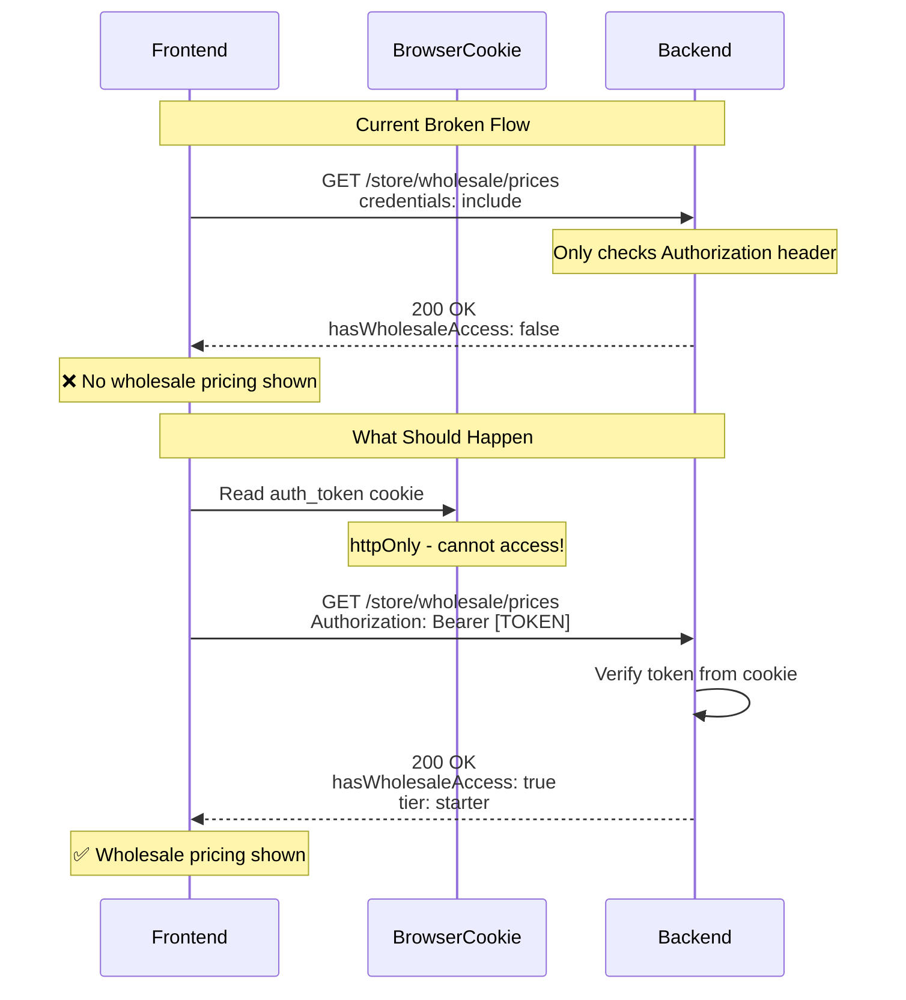

# Wholesale Pricing Debug Report

**Date:** 2026-02-27  
**Issue:** Wholesale page pricing selection not working  
**Status:** Root Cause Identified ✅

---

## Executive Summary

The wholesale pricing selection is not working due to an **authentication mismatch** between frontend and backend. The frontend sends authentication via cookies, but the backend wholesale-pricing routes only read from the Authorization header.

---

## Root Cause Analysis

### Problem 1: Frontend API Methods Missing Authorization Header

**Location:** [`storefront/src/lib/api.ts`](storefront/src/lib/api.ts)

**Affected Methods:**

- [`getWholesalePricing()`](storefront/src/lib/api.ts:973) - Line 973-982
- [`getWholesalePrices()`](storefront/src/lib/api.ts:985) - Line 985-1001

**Current Implementation (Problematic):**

```typescript
async getWholesalePricing() {
  try {
    const res = await fetchWithTrace(`${API_URL}/store/wholesale/prices`, {
      credentials: 'include',  // Only sends cookies
    });
    // ...
  }
}
```

**Issue:** No `Authorization` header is included in the request.

---

### Problem 2: Backend Only Reads Authorization Header

**Location:** [`backend/src/routes/store/wholesale-pricing.ts`](backend/src/routes/store/wholesale-pricing.ts)

**Affected Endpoints:**

- `GET /prices` - Line 22-78
- `POST /calculate` - Line 113-191
- `POST /prices/bulk` - Line 194-237
- `GET /tier/eligibility` - Line 240-264
- `POST /tier/auto-assign` - Line 267-294

**Current Implementation (Problematic):**

```typescript
// Line 24 - Only checks Authorization header
const authHeader = c.req.header('Authorization');
let customerId: string | null = null;

if (authHeader) {
  // Token processing...
}
```

**Issue:** No fallback to read from cookies.

---

### Problem 3: JWT Stored in httpOnly Cookie (Cannot Access from Frontend)

**Location:** [`backend/src/routes/store/auth.ts`](backend/src/routes/store/auth.ts:190)

The JWT token is stored in an **httpOnly cookie** for security:

```typescript
// Line 190 - Sets httpOnly cookie
setAuthCookie(c, result.token);
```

**Impact:** Frontend JavaScript **cannot** read the token to add it to the Authorization header.

---

## Comparison: Working vs Broken Authentication

### Working Authentication (Auth Endpoint)

**Backend:** [`auth.ts:241-243`](backend/src/routes/store/auth.ts:241)

```typescript
const token =
  getCookie(c, 'auth_token') || // Reads cookie
  c.req.header('Authorization')?.replace('Bearer ', ''); // OR header
```

✅ Supports both cookie and Authorization header

### Broken Authentication (Wholesale Pricing)

**Backend:** [`wholesale-pricing.ts:24`](backend/src/routes/store/wholesale-pricing.ts:24)

```typescript
const authHeader = c.req.header('Authorization'); // Only reads header
```

❌ Only supports Authorization header - no cookie fallback

---

## Customer Metadata Requirements

For wholesale pricing to work, customers must have the following metadata in the `customers` table:

| Field                | Required | Example Value                           |
| -------------------- | -------- | --------------------------------------- |
| `wholesale_customer` | Yes      | `true`                                  |
| `discount_tier`      | Yes      | `'starter'`, `'growth'`, `'enterprise'` |
| `company_name`       | Optional | `'Acme Corp'`                           |

**Database Query to Verify:**

```sql
SELECT id, email, metadata->>'wholesale_customer' as wholesale,
       metadata->>'discount_tier' as tier
FROM customers
WHERE email = 'customer@example.com';
```

---

## Recommended Fixes

### Fix 1: Add Cookie Support to Backend (Primary Fix)

**File:** `backend/src/routes/store/wholesale-pricing.ts`

**Changes Needed:**

1. Import `getCookie` from `hono/cookie`
2. Update all endpoints to read from cookie OR Authorization header

**Example Change:**

```typescript
import { getCookie } from 'hono/cookie';

// In each endpoint, replace:
const authHeader = c.req.header('Authorization');

// With:
const token = getCookie(c, 'auth_token') || c.req.header('Authorization')?.replace('Bearer ', '');
const authHeader = token ? `Bearer ${token}` : null;
```

**Endpoints to Update:**

- `GET /prices` (line 24)
- `POST /calculate` (line 116)
- `POST /prices/bulk` (line 197)
- `GET /tier/eligibility` (line 242)
- `POST /tier/auto-assign` (line 269)

---

### Fix 2: Frontend Changes (Not Required After Backend Fix)

After adding cookie support to backend, the frontend should work without changes since cookies are already being sent.

However, for completeness, the frontend could also include:

- Better error handling for 401 responses
- Redirect to login page when wholesale access is denied

---

## Files to Modify

| File                                            | Change Type        | Lines                     |
| ----------------------------------------------- | ------------------ | ------------------------- |
| `backend/src/routes/store/wholesale-pricing.ts` | Add cookie support | 1, 24, 116, 197, 242, 269 |

---

## Testing Checklist

- [ ] Verify customer has correct metadata (`wholesale_customer: true`, `discount_tier: set`)
- [ ] Test wholesale pricing as logged-in customer
- [ ] Verify retail prices shown to non-wholesale customers
- [ ] Test logout/login flow

---

## Mermaid Diagram: Authentication Flow



---

## Conclusion

The wholesale pricing issue is caused by the backend wholesale-pricing routes not supporting cookie-based authentication. The fix requires adding cookie support (using `getCookie`) to match the authentication pattern already used in the auth endpoints.

**Priority:** High - Blocks wholesale customer functionality  
**Effort:** Low - Simple code change (~10 lines)  
**Risk:** Low - No breaking changes, only adds functionality
